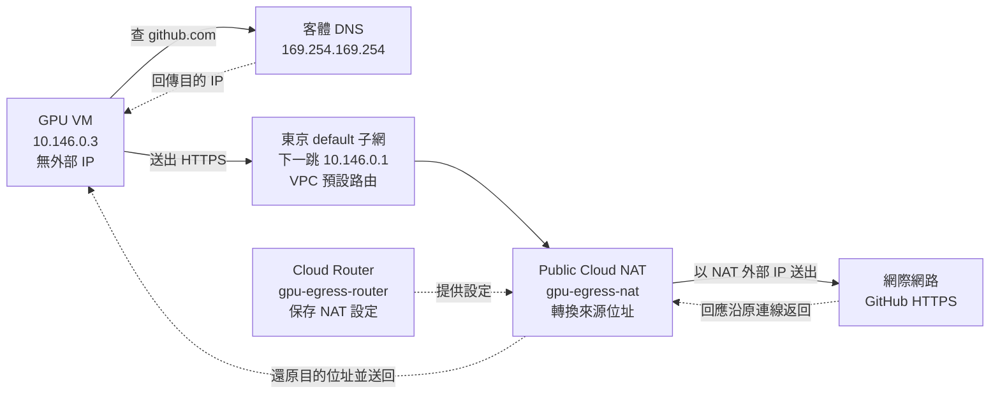

# 模組 04：多節點網路與共享資料路徑

[能力路線](ROADMAP.md)｜職缺核心：網路設定與管理；支撐能力：叢集架構規劃。

## 這個模組在做什麼

把獨立 GPU VM 接入現有教學叢集，檢查兩台 VM 如何找到彼此、
能否連上服務、讀到相同資料，以及工作能否跨節點執行。
本模組也要在 GPU VM 上辨認實際裝置，留下可核對的節點與資料證據。

## 目前做到哪裡

| 節點 | 已確認的位址與位置 | 目前有的證據 |
|---|---|---|
| 控制節點 `instance-20260923-104239` | 台灣 `asia-east1-b`，`10.140.0.2` | 客體位址與路由輸出 |
| GPU 節點 `compute-gpu01` | 東京 `asia-northeast1-c`，`10.146.0.3` | 建機結果；使用者開機後的客體位址與路由輸出 |

**目前進度：** 已保存兩台 VM 的位址與路由輸出。
GPU VM 用私有 IP `ping` 控制節點收到三次回覆，完整名稱解析到
`10.140.0.2`，TCP 22 連線收到 OpenSSH 識別行；
控制節點短主機名在 GPU VM 上仍查不到。
東京 Public Cloud NAT 已建立，GPU VM 對 GitHub 的 HTTPS HEAD 請求
回報 HTTP `200`。尚未驗證 SSH 登入、共享資料或跨節點工作。
歷史上曾停止 GPU VM；那次 `TERMINATED` 輸出不是現在的狀態。

## 要驗證的工作路徑

控制節點要把工作交給 GPU 節點，工作還要讀得到資料。
從「找到主機」到「工作完成」是不同關卡，不能用一條 `ping` 代替整條路徑。

**下一跳**是 VM 送出封包時先交給的網路位址，不是封包的最終目的地。
路由表的 `default via ... dev eth0` 表示：沒有更明確的路由時，
從 `eth0` 把封包交給 `via` 後面的位址，再由網路繼續轉送。

| 關卡 | 用什麼看 | 要得到的證據 |
|---|---|---|
| 位址與路由 | `ip -br addr`、`ip route` | 各 VM 的私有 IP、介面與下一跳；有路由不等於服務可連 |
| 名稱與連線 | `getent hosts`、`ssh`、`ss` | 名稱解析到預期 IP、SSH 實際連線；必要時分查雲端及客體防火牆 |
| 共享資料 | `findmnt`、`namei -l`、兩端 UID/GID | 同一路徑可讀寫，掛載與逐層權限相符 |
| GPU 與工作 | `nvidia-smi`、實際工作輸出 | 裝置可見、工作取得資源且答案正確；看見 GPU 不等於排程已分配 |

NFS 讓兩台 VM 使用同一份檔案，但有單點故障與效能限制。
本模組的完成證據是兩台獨立 VM 互通、共享資料讀寫、跨節點工作，
以及 GPU 裝置辨認；單卡 VM 不代表多卡互連或 RDMA 已驗證。
可重跑設定與拓撲決策放在 [project/docs/](../project/docs/)。

## 2026-09-30：控制節點基線

專案為 `project-78b8a95c-a2c0-461f-a08`。
控制節點位於台灣 `asia-east1-b`，使用 `default` VPC。
先查位址與路由，建立之後對照 GPU 節點的基線。
兩條命令都只讀，不改檔案、服務或雲端資源。

**位址：**

```bash
ip -br addr
```

```text
lo               UNKNOWN        127.0.0.1/8 ::1/128
eth0             UP             10.140.0.2/32 fe80::2725:28ff:b62c:9e10/64
```

`eth0` 已啟用，私有 IPv4 為 `10.140.0.2`。
`/32` 是客體介面顯示值，不能拿來推論 VPC 子網大小。

**路由：**

```bash
ip route
```

```text
default via 10.140.0.1 dev eth0 proto dhcp src 10.140.0.2 metric 100
10.140.0.1 dev eth0 proto dhcp scope link src 10.140.0.2 metric 100
```

`10.140.0.1` 是預設下一跳。Compute Engine API 顯示控制節點位於
`default` VPC 的 `asia-east1/default` 子網，子網 CIDR 為
`10.140.0.0/20`。

## 2026-10-01：東京 GPU 節點建立

建成的節點是 `compute-gpu01`：`g2-standard-4`（4 vCPU、16 GiB、
一張 NVIDIA L4），位於東京 `asia-northeast1-c`。
使用 AlmaLinux 10、`default` VPC、40 GiB `pd-balanced` 開機磁碟；
只配置私有 IP，不配置 VM 服務帳戶。
建立 VM 與磁碟會產生費用，停止後磁碟仍計費；
東京與台灣節點間的流量也可能計費。

### 建立命令與結果

```bash
gcloud compute instances create compute-gpu01 \
  --project=project-78b8a95c-a2c0-461f-a08 \
  --zone=asia-northeast1-c \
  --machine-type=g2-standard-4 \
  --image-project=almalinux-cloud \
  --image=almalinux-10-v20260811 \
  --boot-disk-type=pd-balanced \
  --boot-disk-size=40GB \
  --network=default \
  --subnet=default \
  --no-address \
  --no-service-account \
  --no-scopes \
  --maintenance-policy=TERMINATE \
  --max-run-duration=2h \
  --instance-termination-action=STOP \
  --quiet
```

建機成功。輸出的必要欄位：

```text
NAME           ZONE               MACHINE_TYPE   INTERNAL_IP  EXTERNAL_IP  STATUS
compute-gpu01  asia-northeast1-c  g2-standard-4  10.146.0.3               RUNNING
```

### 建立後核對

以下命令唯讀查詢 VM 實際設定：

```bash
gcloud compute instances describe compute-gpu01 \
  --project=project-78b8a95c-a2c0-461f-a08 \
  --zone=asia-northeast1-c \
  --format='json(name,status,zone,machineType,networkInterfaces,serviceAccounts,disks,resourcePolicies,terminationTime,maxRunDuration,instanceTerminationAction,scheduling)'
```

從實際回傳擷取必要欄位，省略其他 API 欄位：

```json
{
  "name": "compute-gpu01",
  "status": "RUNNING",
  "machineType": "https://www.googleapis.com/compute/v1/projects/project-78b8a95c-a2c0-461f-a08/zones/asia-northeast1-c/machineTypes/g2-standard-4",
  "networkInterfaces": [{"networkIP": "10.146.0.3"}],
  "disks": [{"boot": true, "diskSizeGb": "40", "autoDelete": true}],
  "scheduling": {
    "maxRunDuration": {"seconds": "7200"},
    "instanceTerminationAction": "STOP"
  }
}
```

**判讀：** 查詢當時為 `RUNNING`，私有 IP `10.146.0.3`，
回傳沒有外部 IP 或服務帳戶欄位。開機磁碟為 40 GiB；
`autoDelete: true` 表示刪除 VM 時會刪除該磁碟。
`7200` 秒與 `STOP` 是當時查得的單次執行限制及到時動作，
不能用這次建立後的查詢結果代表現在的 VM 狀態。

## 2026-10-01：依要求停止 VM

建機後當天先停止 VM，以免繼續累積運算費；
這個操作保留開機磁碟，日後可再啟動。

```bash
gcloud compute instances stop compute-gpu01 \
  --project=project-78b8a95c-a2c0-461f-a08 \
  --zone=asia-northeast1-c \
  --quiet
```

停止命令的完成訊息：

```text
Updated [https://compute.googleapis.com/compute/v1/projects/project-78b8a95c-a2c0-461f-a08/zones/asia-northeast1-c/instances/compute-gpu01].
```

再以唯讀命令核對：

```bash
gcloud compute instances describe compute-gpu01 \
  --project=project-78b8a95c-a2c0-461f-a08 \
  --zone=asia-northeast1-c \
  --format='value(status)'
```

```text
TERMINATED
```

**判讀：** VM 已停止，未刪除 VM 或磁碟；磁碟仍保留並計費。
之後使用者自行開機；以下客體命令及輸出證明開機後進入過 GPU VM，
但沒有再查 Compute Engine 的最新 `status`。

## GPU VM 開機後：先核對客體網路位址

在 `compute-gpu01` 的終端執行 `ip -br addr`，確認實際啟用的網路介面
與客體系統取得的私有 IP，對照建機紀錄的 `10.146.0.3`。
這條命令只讀網路狀態，不改 VM、介面、服務或檔案。

```bash
ip -br addr
```

```text
lo               UNKNOWN        127.0.0.1/8 ::1/128
eth0             UP             10.146.0.3/32 fe80::e8c5:bdc0:3c16:4b48/64
```

**判讀：** `eth0` 已啟用，客體私有 IPv4 `10.146.0.3`
與建機時的位址相符。介面上的 `/32` 不代表整個 VPC 子網的大小。

接著在同一台 GPU VM 查路由表，確認送往其他位址時會使用的下一跳。
這條命令只讀，不改路由、介面或檔案。

```bash
ip route
```

```text
default via 10.146.0.1 dev eth0 proto dhcp src 10.146.0.3 metric 100
10.146.0.1 dev eth0 proto dhcp scope link src 10.146.0.3 metric 100
```

**判讀：** GPU VM 的來源位址是 `10.146.0.3`。若要連控制節點
`10.140.0.2`，這張路由表指示 VM 先從 `eth0` 把封包交給
`10.146.0.1`，再由網路轉送；封包的目的地仍是 `10.140.0.2`。
`10.146.0.1` 是網路下一跳，不是另一台控制節點。
有路由只表示本機知道先交給誰，尚未證明控制節點可達。

### 控制節點短主機名解析

控制節點先前執行工作時的主機名是 `instance-20260923-104239`。
在 GPU VM 查系統目前會把這個名稱解析成哪個位址；
若沒有輸出或不是 `10.140.0.2`，先定位名稱解析設定，不直接假設網路故障。
這條命令只讀，不改 DNS、`/etc/hosts` 或網路設定。

```bash
getent hosts instance-20260923-104239
```

```text
（無輸出）
```

**判讀：** GPU VM 當時沒有把控制節點的短主機名解析成位址。
這是名稱解析層的結果，不能據此判定私有 IP 連線是否可用。

### 查 GPU VM 的 DNS 設定

`/etc/resolv.conf` 列出這台 VM 使用的 DNS 伺服器及搜尋網域。
先讀取它，判斷短主機名是否會被補上預期的網域；
這條命令不修改 DNS、網路或檔案。

```bash
cat /etc/resolv.conf
```

```text
# Generated by NetworkManager
search asia-northeast1-c.c.project-78b8a95c-a2c0-461f-a08.internal c.project-78b8a95c-a2c0-461f-a08.internal google.internal
nameserver 169.254.169.254
```

**判讀：** `search` 列出查詢短主機名時可嘗試補上的網域；
第一個是 GPU VM 所在的東京 `asia-northeast1-c`，
而控制節點位於台灣 `asia-east1-b`。
`nameserver` 是這台 VM 送出 DNS 查詢的位址，並不是控制節點位址。
這份設定能說明短名查詢可能落在錯誤的區域，
但沒有直接證明 DNS 對完整名稱的回應，也沒有測到兩台 VM 的連線。

### 先檢查私有 IP 是否可達

在 GPU VM 向控制節點已知的私有 IP `10.140.0.2` 送三個 ICMP 封包。
這繞過名稱解析，先檢查網路路徑是否容許這種流量；
命令只產生少量封包，不改設定、檔案或雲端資源。

```bash
ping -c 3 -W 2 10.140.0.2
```

若收到回覆，可確認這種流量能從 GPU VM 抵達控制節點並返回；
若沒有回覆，還需分辨路由、雲端防火牆或客體防火牆，
不能只憑 `ping` 判定所有服務都不通。

實際收到的輸出如下；提供的紀錄沒有結尾統計行：

```text
PING 10.140.0.2 (10.140.0.2) 56(84) bytes of data.
64 bytes from 10.140.0.2: icmp_seq=1 ttl=64 time=39.6 ms
64 bytes from 10.140.0.2: icmp_seq=2 ttl=64 time=38.6 ms
64 bytes from 10.140.0.2: icmp_seq=3 ttl=64 time=38.5 ms
```

**判讀：** 三個序號都有來自控制節點私有 IP 的回覆，
各次往返約 38–40 ms。這證明當時 ICMP 封包能往返，
尚不能證明 SSH 等服務可用；短主機名查不到仍是獨立的名稱解析問題。

### 查控制節點的完整內部名稱

Google Cloud 的可用區型內部 DNS 名稱包含 VM 名稱、所在可用區與專案 ID。
控制節點位於 `asia-east1-b`，因此在 GPU VM 查下列完整名稱，
看是否取得已知的控制節點私有 IP `10.140.0.2`。
`getent hosts` 透過客體系統的名稱解析設定查詢並印出位址；
這條命令只讀，不更改 DNS、網路、檔案或雲端資源。

```bash
getent hosts instance-20260923-104239.asia-east1-b.c.project-78b8a95c-a2c0-461f-a08.internal
```

若回傳 `10.140.0.2`，代表完整名稱解析到已知的控制節點位址；
若無輸出或位址不同，再查名稱與 DNS 紀錄。

實際輸出：

```text
10.140.0.2      instance-20260923-104239.asia-east1-b.c.project-78b8a95c-a2c0-461f-a08.internal
```

**判讀：** 完整名稱正確解析到控制節點已知的私有 IP。
先前短名沒有輸出，與 GPU VM 的搜尋網域只列東京可用區及專案網域相符；
使用完整名稱可明確指定控制節點所在的台灣可用區。
DNS 正確與 ICMP 可往返，仍不能代替 SSH 服務的驗證。

### 檢查 SSH 服務入口

SSH 服務通常監聽 TCP 22 埠。GPU VM 用 Bash 的 `/dev/tcp` 功能
連到控制節點的 `10.140.0.2:22`，讀取服務首先送出的識別行；
`timeout 5` 限制整條命令最多等待五秒。
這只建立一次 TCP 連線、讀取回應，不嘗試登入或更改 VM 設定；
服務端可能留下連線日誌。

```bash
timeout 5 bash -c 'exec 3<>/dev/tcp/10.140.0.2/22; read -r line <&3; printf "%s\n" "$line"'
```

```text
SSH-2.0-OpenSSH_9.9
```

**判讀：** GPU VM 已連到控制節點的 TCP 22 埠，並收到 OpenSSH 的服務識別行。
這證明 SSH 服務入口當時可達；尚未驗證 `a2264` 帳號能否登入、
金鑰是否可用，也沒有執行遠端命令。

## 東京 GPU VM 對外出口

### 原本缺少什麼

建機命令中的 `--no-address` 讓 `compute-gpu01` 只有私有 IP
`10.146.0.3`，沒有直接附在 VM 上的外部 IP。
這能避免 VM 直接暴露在網際網路上，但主動連外仍需要
把私有來源位址轉換成可在網際網路上使用的來源位址，稱為**來源位址轉換**。
建機時沒有同時配置東京子網的 Public Cloud NAT，因此缺少這個轉換出口。

GPU VM 原本已有客體預設下一跳 `10.146.0.1`；
專案 `default` VPC 也有通往預設網際網路閘道的 `0.0.0.0/0` 路由。
**有路由只表示封包知道往哪裡送**，不會替沒有外部 IP 的 VM
完成來源位址轉換，所以當時仍無法直接連到 GitHub 下載套件。
DNS 伺服器 `169.254.169.254` 用來解析名稱，不是對外出口。
先前 GPU VM 能 `ping` 到控制節點，是兩台 VM 在 VPC 內用私有 IP
互通的證據，與能否連上網際網路是兩條不同路徑。

### 新增了什麼、各自做什麼

已唯讀確認 GPU VM 位於 `default` VPC 的東京 `default` 子網
`10.146.0.0/20`。建立前東京沒有 Cloud Router；
當時該子網只有 `compute-gpu01` 一台 VM。

| 新增資源 | 位置與範圍 | 功能 |
|---|---|---|
| Cloud Router `gpu-egress-router` | 東京 `asia-northeast1`、`default` VPC | 承載 NAT 設定；不是 GPU VM 封包會經過的一台路由器 |
| Public Cloud NAT `gpu-egress-nat` | 東京 `default` 子網的主要 IP 範圍 | 讓符合範圍且沒有外部 IP 的 VM 主動連外，並把回應送回原 VM |
| NAT 自動分配的外部 IP | 指派給 NAT，不指派給 GPU VM | 對外連線使用的來源 IP；實際數值尚未在紀錄中查出 |

這個 NAT 範圍目前涵蓋 GPU VM；日後加入同一子網主要 IP 範圍、
且沒有外部 IP 的 VM，也會使用它。Public Cloud NAT 只處理主動連線的回應，
不開放網際網路上的主機主動連入 GPU VM；GPU VM 仍沒有外部 IP。
[Cloud NAT 機制](https://docs.cloud.google.com/nat/docs/overview)

### 從 GPU VM 連到 GitHub 的流程

`curl` 先由客體的 DNS 解析 `github.com`，再送出 HTTPS 連線。
下圖的實線是主動連外路徑，虛線是回應或設定關係；
Cloud Router 僅保存 NAT 設定，不在封包傳輸路徑上。



NAT 資源會留下並持續計費；以目前一台 VM 和一個 NAT IP 估算，
基本費用約 US$0.0064／小時，另計處理流量與對外傳輸。
不再需要時，先刪 NAT 再刪 Router，即可撤銷對外出口及其持續費用。
[Cloud NAT 計價](https://cloud.google.com/nat/pricing)

### 建立與核對紀錄

以下命令在控制節點執行，作用於專案
`project-78b8a95c-a2c0-461f-a08`，不更改 GPU VM 的外部 IP、
入站防火牆或客體檔案。

**建立 Cloud Router：**

```bash
gcloud compute routers create gpu-egress-router \
  --project=project-78b8a95c-a2c0-461f-a08 \
  --region=asia-northeast1 \
  --network=default \
  --quiet
```

```text
Creating router [gpu-egress-router]...
......done.
NAME               REGION           NETWORK
gpu-egress-router  asia-northeast1  default
```

**判讀：** Router 已建立在東京 `default` VPC；此時尚無 NAT，
GPU VM 仍不能因此直接連外。

**建立 Public Cloud NAT：**

```bash
gcloud compute routers nats create gpu-egress-nat \
  --project=project-78b8a95c-a2c0-461f-a08 \
  --router=gpu-egress-router \
  --region=asia-northeast1 \
  --nat-custom-subnet-ip-ranges=default \
  --auto-allocate-nat-external-ips \
  --quiet
```

```text
Creating NAT [gpu-egress-nat] in router [gpu-egress-router]...
......done.
```

**判讀：** NAT 建立命令成功；仍須核對實際涵蓋範圍，
並在 GPU VM 實測對外連線。

**核對 NAT 設定：**

```bash
gcloud compute routers nats describe gpu-egress-nat \
  --project=project-78b8a95c-a2c0-461f-a08 \
  --router=gpu-egress-router \
  --region=asia-northeast1
```

```text
autoNetworkTier: PREMIUM
effectiveTcpTimeWaitTimeoutSec: 30
enableEndpointIndependentMapping: false
endpointTypes:
- ENDPOINT_TYPE_VM
name: gpu-egress-nat
natIpAllocateOption: AUTO_ONLY
sourceSubnetworkIpRangesToNat: LIST_OF_SUBNETWORKS
subnetworks:
- name: https://www.googleapis.com/compute/v1/projects/project-78b8a95c-a2c0-461f-a08/regions/asia-northeast1/subnetworks/default
  sourceIpRangesToNat:
  - PRIMARY_IP_RANGE
type: PUBLIC
```

**判讀：** NAT 類型為 Public，對外 IP 自動分配；
作用範圍是東京 `default` 子網的主要 IP 範圍。
這核對了雲端設定，仍須在 GPU VM 實測。

### 從 GPU VM 驗證 HTTPS 對外連線

在 GPU VM 向 GitHub 發送 HTTPS HEAD 請求，只讀取回應標頭，
確認 DNS、TCP、TLS 與 HTTP 路徑可用。
`--max-time 15` 限制等待十五秒；命令不下載檔案、不改客體設定。

```bash
curl --head --max-time 15 https://github.com
```

**實際回報：** HTTP `200`；本次沒有提供完整回應標頭，
因此不補寫其他 `curl` 輸出。

**判讀：** GPU VM 當時已完成名稱解析與 HTTPS 請求，
GitHub 回傳成功狀態，證明這條對外路徑可用。
這不代表所有網站或套件庫都已驗證，也不會自動安裝任何工具。
