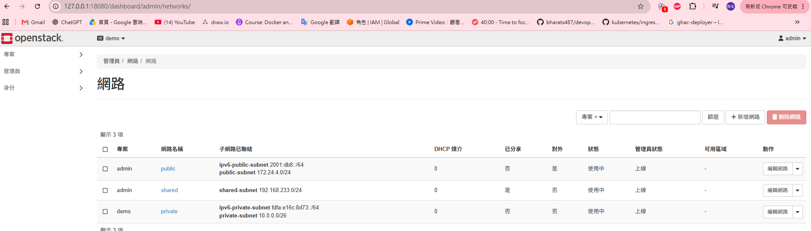

# 模組 05：HPC 叢集建置與管理自動化

[能力路線](ROADMAP.md)｜職缺核心：叢集建置與管理自動化。

## 要解決的問題與交付物

**問題與目標：** 模組 04 已讓控制節點透過 SSH 在 GPU VM 執行 MPI 工作，
兩台 VM 也能讀寫 NFS 共享目錄。這證明計算與資料通路可用，
但當時 GPU VM 並未接受 Slurm 排程。
本模組把節點設定寫成可重跑的 Ansible playbook，
讓控制端能管理 GPU VM 的身分驗證、Slurm 設定和運算服務。
本模組接著由現有 DevStack 的 OpenStack 服務供給乾淨 CPU VM，
再用 Ansible 從新系統配置可驗證的 CPU 叢集服務。
既有 GCP VM 的 GPU 工作結果另列，不當作 OpenStack GPU 重建。

**目前成果：** 已完成既有兩台 VM 的 NFS、MUNGE、Slurm 服務帳號及兩節點設定部署。
控制端已看到 GPU 節點；一般帳號透過 Slurm 請求一張 GPU，
並在該分區執行二維熱擴散工作，使用 L4 算出與 CPU 一致的結果。
現有結果仍未驗證 OpenStack 供給的乾淨 CPU VM 與 Ansible 首次部署。

## 管理位置與本次部署範圍

**執行位置：** 所有 Ansible 指令都在**控制節點**的
`/root/hpc-arch/project/ansible` 目錄以 root 執行。
[ansible.cfg](../project/ansible/ansible.cfg) 指向
[hosts.yml](../project/ansible/inventory/hosts.yml)，
其中 `controller` 是控制節點本機，`gpu_compute` 是透過既有 SSH 金鑰
連到私有 IP `10.146.0.3` 的 `compute-gpu01`。
Inventory 只列出已存在的 VM，不會建立雲端資源。

**閱讀順序：** 下方先交代已建立的管理通路、NFS 和 MUNGE 前提及其自動化證據。
**本次兩節點 Slurm 部署的步驟從「1. 核對資源與帳號」開始：**
先核對 GPU VM 與兩台 VM 的帳號空間，
再執行 `slurm-identity.yml`，最後才執行 `slurm-two-node.yml`。
每個步驟都把指令、執行的檔案、檔案內的任務和實際結果放在一起。

**檔案位置：** 工作樹中的 `project/` 檔案是**部署來源**；
`/etc/` 下的檔案才是各 VM 服務實際讀取的檔案。
相同路徑出現在兩台 VM 時，各自是本機磁碟上的一份，並非同一個檔案。
下方每個步驟分別說明來源、目標及服務何時讀取。

## 已建立的 Ansible 管理通路

**管理通路：** Ansible 沿用模組 04 已驗證的 SSH 管理通路。
**Inventory** 列目標主機；**playbook** 描述檔案、掛載和服務應有的狀態；
**handler** 在任務真的變更時才由 `notify` 觸發。
正式執行的 `changed` 表示已改動受管狀態；`changed=0` 表示重跑沒有額外變更。
`--syntax-check` 只解析 playbook，`--check --diff` 只預演，
都不能當成檔案已複製或服務已啟動。

**目的與影響：** 在控制節點執行下列指令。它先讀取目前目錄的
[ansible.cfg](../project/ansible/ansible.cfg)，再依設定讀取
[hosts.yml](../project/ansible/inventory/hosts.yml) 並列出群組與主機；
這裡沒有執行 playbook，也不連線或修改 GPU VM：

**已執行指令：**

```bash
ansible-inventory --graph
```

**實際輸出：**

```text
@all:
  |--@ungrouped:
  |--@controller:
  |  |--instance-20260923-104239
  |--@gpu_compute:
  |  |--compute-gpu01
```

**判讀與下一步：** 兩個群組各有預期的 VM。下一條指令仍用 `hosts.yml` 選
`gpu_compute`，再透過 SSH 在 GPU VM 執行 Ansible 的 `ping` 模組。
這裡也沒有執行 playbook；這個 `ping` 不是 ICMP，
回傳 `pong` 才代表遠端模組可執行：

**已執行指令：**

```bash
ansible -i /root/hpc-arch/project/ansible/inventory/hosts.yml gpu_compute -m ansible.builtin.ping
```

**實際輸出：**

```text
compute-gpu01 | SUCCESS => {
    "ansible_facts": {"discovered_interpreter_python": "/usr/bin/python3"},
    "changed": false,
    "ping": "pong"
}
```

## 已完成的 NFS 自動化

**已有能力：** 模組 04 已手動驗證兩台 VM 對 `/srv/hpc-share` 的雙向讀寫。
第一條指令執行
[nfs-controller.yml](../project/ansible/nfs-controller.yml)。
該檔在**控制節點**依序確認 `nfs-utils`、核對 `/srv/hpc-share`
的擁有者和權限、把工作樹中的
[hpc-share.exports](../project/nfs/hpc-share.exports) 複製到
控制節點自己的 `/etc/exports.d/hpc-share.exports`，
最後確認 `nfs-server` 正在運行。
匯出檔真的改動時，handler 才執行 `exportfs -ra` 重新讀取分享清單。

**已執行指令：**

```bash
ansible-playbook -i /root/hpc-arch/project/ansible/inventory/hosts.yml /root/hpc-arch/project/ansible/nfs-controller.yml
```

**實際輸出：**

```text
PLAY RECAP
instance-20260923-104239 : ok=5 changed=0 unreachable=0 failed=0 skipped=0 rescued=0 ignored=0
```

**目的與影響：** [nfs-gpu-client.yml](../project/ansible/nfs-gpu-client.yml)
由下一條指令執行。它在 **GPU VM** 先確認 `nfs-utils`，
再把控制節點 `10.140.0.2:/srv/hpc-share` 接到**GPU VM 自己的**
`/srv/hpc-share`，同時核對 GPU VM 的 `/etc/fstab` 項目與掛載狀態。
`ansible.posix.mount` 來自
[requirements.yml](../project/ansible/requirements.yml) 固定的
`ansible.posix:2.2.2`；實際已安裝該版本。
掛載選項為 `rw,vers=4.2,_netdev,nofail,x-systemd.automount`，
用途與副作用寫在 playbook 中文註解中。
正式執行與重跑都沒有改動既有掛載：

**已執行指令：**

```bash
ansible-playbook nfs-gpu-client.yml
```

**實際輸出：**

```text
PLAY RECAP
compute-gpu01 : ok=3 changed=0 unreachable=0 failed=0 skipped=0 rescued=0 ignored=0
```

**判讀：** 同一指令重跑的結果也為 `ok=3 changed=0 failed=0`。
這證明既有兩台 VM 的 NFS 狀態符合 playbook，
並沒有提供乾淨節點首次建立掛載的證據。

## 已完成的 MUNGE 跨節點身分驗證

**新增能力的原因：** 模組 04 的 MPI 工作由 SSH 啟動，不需要 GPU VM 的 Slurm 服務。
要由 Slurm 控制端分配工作，GPU VM 的 `slurmd` 必須能用 MUNGE
驗證同一叢集的請求。兩台 VM 使用控制節點既有的 MUNGE 金鑰；
金鑰內容只留在 VM 的 `/etc/munge/munge.key`，不存入專案或輸出。

**已安裝套件：** GPU VM 已安裝與控制節點同版的運算端套件：

| 套件 | 已安裝版本 | 用途 |
|---|---|---|
| `munge`、`munge-libs` | `0.5.15-11.el10_1.x86_64` | 產生與驗證憑證 |
| `slurm`、`slurm-slurmd` | `26.05.4-1.el10.x86_64` | 運算節點的 Slurm 元件與服務 |

同一筆安裝交易另帶入 `bash-completion`、`mariadb-connector-c`、
`mariadb-connector-c-config`；套件準備不是本模組的操作重點。

**目的與影響：** 下列指令執行 [munge-gpu.yml](../project/ansible/munge-gpu.yml)。
該檔在 **GPU VM** 依序核對 MUNGE 目錄權限、
從**控制節點的** `/etc/munge/munge.key` 複製金鑰到
**GPU VM 自己的**同名路徑、設為 `munge:munge` 與 `0600`，
最後啟用 GPU VM 的 `munge` 服務。
金鑰真的改動時，handler 才重啟 GPU VM 的 MUNGE；
Ansible 不顯示金鑰內容或差異。

**已執行指令：**

```bash
ansible-playbook munge-gpu.yml
```

**實際輸出：**

```text
TASK [部署叢集共用的 MUNGE 金鑰]           changed: [compute-gpu01]
TASK [確保 GPU VM 的 MUNGE 已啟動]         changed: [compute-gpu01]
RUNNING HANDLER [重新啟動 GPU VM 的 MUNGE] changed: [compute-gpu01]
PLAY RECAP
compute-gpu01 : ok=5 changed=3 unreachable=0 failed=0 skipped=0 rescued=0 ignored=0
```

**驗證目的：** 在控制節點以 `a2264` 產生短效憑證，經既有 SSH 金鑰交給 GPU VM 的
`unmunge` 解碼；左側 `munge -n` 不把金鑰輸出，管線只傳短效憑證。
`-i` 選 SSH 私鑰，`IdentitiesOnly=yes` 限定使用該金鑰，
`BatchMode=yes` 不互動詢問，`ConnectTimeout=5` 限制連線等待。
這只檢查驗證通路，不提交 Slurm 工作或改動服務：

**已執行指令：**

```bash
sudo -u a2264 -- munge -n | sudo -u a2264 -- ssh -i /home/a2264/.ssh/hpc_gpu_ed25519 -o IdentitiesOnly=yes -o BatchMode=yes -o ConnectTimeout=5 a2264@10.146.0.3 unmunge
```

**實際輸出：**

```text
STATUS:          Success (0)
ENCODE_HOST:     instance-20260923-104239.asia-east1-b.c.project-78b8a95c-a2c0-461f-a08.internal (10.140.0.2)
UID:             a2264 (1000)
GID:             a2264 (1005)
```

**判讀：** GPU VM 成功解碼控制節點的憑證，證明跨 VM 的 MUNGE 驗證通路可用。
重跑 `ansible-playbook munge-gpu.yml` 得到 `ok=4 changed=0 failed=0`，
沒有重新複製金鑰或重啟服務。

## 1. 核對 GPU VM 資源與帳號空間

**目的：** Slurm 按節點宣告的 CPU、記憶體和 **GRES**（通用資源）分配工作；
GPU 是本叢集的 GRES。先在 GPU VM 以 `a2264` 執行 `slurmd -C`，
直接讀取本機硬體並列出建議節點設定；
這條指令不執行 playbook，也不啟動服務：

**已執行指令：**

```bash
slurmd -C
```

**實際輸出：**

```text
NodeName=compute-gpu01 CPUs=4 Boards=1 SocketsPerBoard=1 CoresPerSocket=2 ThreadsPerCore=2 RealMemory=15983 Gres=gpu:nvidia_l4:1
Found gpu:nvidia_l4:1 with Autodetect=nvidia (Substring of gpu name may be used instead)
```

**判讀：** GPU VM 有 4 個邏輯 CPU、15,983 MiB 記憶體和一張 NVIDIA L4。
兩節點設定只宣告 14,000 MiB 給工作，保留其餘容量給系統與服務。
`slurmd -C` 是硬體探測，不能當成 GPU 已交由 Slurm 分配。

### 為何要統一帳號編號

**概念：** Linux 帳號除了名稱，還有數字身分：**UID** 是使用者編號，
**GID** 是群組編號；檔案擁有權和服務身分會用到它們。
`800:800` 表示 UID 800 的使用者，其主要群組是 GID 800。
兩台 VM 即使都有叫 `slurm` 的帳號，也要核對數字身分。

**現有帳號：** 控制節點的 `slurm` 在[模組 01 的單節點建置](module-01.md#驗證身分與服務)
由 `useradd -r -M -U -s /sbin/nologin slurm` 建立；
當時 `id slurm` 回報 `uid=994(slurm) gid=994(slurm)`。
GPU VM 的 `994:994` 已屬於 `munge`，不能照搬控制節點的數字。
改號前要找出兩台 VM 都沒有占用的
使用者編號和群組編號。在控制節點的 Ansible 目錄以 root 執行
兩條只讀查詢，**不執行 playbook 檔案**：第一條查兩台 VM 的 UID 800，
第二條查 GID 800。
`ansible all` 選兩台 VM；`getent` 讀帳號資料庫；
`fail_key=false` 讓查無資料回傳空值。查詢不建立帳號或群組。

**已執行指令：**

```bash
ansible all -m ansible.builtin.getent -a 'database=passwd key=800 fail_key=false'
ansible all -m ansible.builtin.getent -a 'database=group key=800 fail_key=false'
```

`getent_passwd["800"]`、`getent_group["800"]` 是輸出中的
使用者與群組查詢欄位，**不是指令**。實際結果如下；
`null` 表示該 VM 找不到這個編號：

| 查詢 | 控制節點 | GPU VM |
|---|---|---|
| `getent_passwd["800"]` | `null` | `null` |
| `getent_group["800"]` | `null` | `null` |

**判讀：** 兩台 VM 的 UID 與 GID 800 都未占用，因此選 `800:800`。

**改號影響：** 控制節點的 `/var/spool/slurmctld` 保存排程狀態，
原本由 UID/GID `994:994` 的 `slurm` 帳號持有。
只改帳號編號，舊狀態檔不會自動變成新帳號的檔案；
因此下方 playbook 也把這個目錄及其內容交給新的 `800:800` 帳號。

## 2. 執行 slurm-identity.yml：統一服務帳號

**目的與執行位置：** 在控制節點的 Ansible 目錄以 root **正式執行**：

**已執行指令：**

```bash
ansible-playbook slurm-identity.yml
```

這條指令執行的是
[slurm-identity.yml](../project/ansible/slurm-identity.yml)。
檔案中的任務依序處理：

1. 在 **GPU VM** 建立不能互動登入、沒有家目錄的 `slurm` 群組與使用者，
   UID/GID 固定為 `800:800`，再用 `id slurm` 核對。
2. 在**控制節點**確認原帳號是 `994:994` 或已改為 `800:800`；
   第一次改號時先確認沒有工作，再停止 `slurmctld`。
3. 將控制節點的 `slurm` 群組和使用者改為 `800:800`，
   並把 `/var/spool/slurmctld` 及其中排程狀態交給新帳號。
4. 啟動控制節點的 `slurmctld`，用 `id slurm` 與 `scontrol ping` 核對。
   重跑時若已是 `800:800`，跳過停機及改號。

若控制端遷移途中失敗，檔案中的救援任務會嘗試恢復原本的
`994:994` 與服務；若連線中斷，仍需依實際狀態人工核對。
這一步會變更兩台 VM 的系統帳號，並短暫中斷控制端排程服務；
不建立 VM、不安裝套件。

**實際輸出：** 下列是這次指令的實際關鍵輸出：

```text
PLAY [建立 GPU VM 的 Slurm 服務帳號]
TASK [備妥 GPU VM 的 slurm 群組]           changed: [compute-gpu01]
TASK [備妥 GPU VM 的 slurm 使用者]         changed: [compute-gpu01]
"gpu_slurm_id.stdout": "uid=800(slurm) gid=800(slurm) groups=800(slurm)"
PLAY [將控制節點的 Slurm 服務帳號遷移到相同身分數字]
TASK [變更身分前確認 Slurm 沒有工作]       ok: [instance-20260923-104239]
TASK [暫停控制節點的 slurmctld]           changed: [instance-20260923-104239]
TASK [將控制節點的 slurm 群組改為 GID 800] changed: [instance-20260923-104239]
TASK [將控制節點的 slurm 使用者改為 UID 800] changed: [instance-20260923-104239]
TASK [讓遷移後的帳號持有控制節點排程狀態] changed: [instance-20260923-104239]
TASK [恢復控制節點的 slurmctld]           changed: [instance-20260923-104239]
"controller_slurm_id.stdout": "uid=800(slurm) gid=800(slurm) groups=800(slurm)"
"controller_slurm_ping.stdout": "Slurmctld(primary) at instance-20260923-104239 is UP"
PLAY RECAP
compute-gpu01            : ok=5 changed=2 unreachable=0 failed=0 skipped=0 rescued=0 ignored=0
instance-20260923-104239 : ok=14 changed=5 unreachable=0 failed=0 skipped=0 rescued=0 ignored=0
```

**判讀：** 兩台 VM 都實際回報 `800:800`；控制服務在遷移後回應 `UP`。
在控制節點同一目錄以 root 重跑，核對帳號設定不再改動；
如果實際狀態已偏移，playbook 仍可能修正帳號或服務：

**已執行指令：**

```bash
ansible-playbook slurm-identity.yml
```

**實際輸出：**

```text
TASK [備妥 GPU VM 的 slurm 群組]   ok: [compute-gpu01]
TASK [備妥 GPU VM 的 slurm 使用者] ok: [compute-gpu01]
"gpu_slurm_id.stdout": "uid=800(slurm) gid=800(slurm) groups=800(slurm)"
TASK [確認控制節點的原身分或目標身分完整] ok: [instance-20260923-104239]
TASK [變更身分前確認 Slurm 沒有工作] skipping: [instance-20260923-104239]
TASK [暫停控制節點的 slurmctld] skipping: [instance-20260923-104239]
TASK [將控制節點的 slurm 群組改為 GID 800] skipping: [instance-20260923-104239]
TASK [將控制節點的 slurm 使用者改為 UID 800] skipping: [instance-20260923-104239]
TASK [讓遷移後的帳號持有控制節點排程狀態] skipping: [instance-20260923-104239]
TASK [恢復控制節點的 slurmctld] skipping: [instance-20260923-104239]
TASK [核對控制節點排程服務已回應] skipping: [instance-20260923-104239]
PLAY RECAP
compute-gpu01            : ok=5 changed=0 unreachable=0 failed=0 skipped=0 rescued=0 ignored=0
instance-20260923-104239 : ok=4 changed=0 unreachable=0 failed=0 skipped=10 rescued=0 ignored=0
```

**重跑判讀：** 跳過的 10 個任務是首次遷移用的工作檢查、停機、改號與服務核對；
重跑沒有再次停止服務。重跑本身沒有重新 ping 控制服務，
`UP` 是首次正式執行的驗證結果。

## 3. 執行 slurm-two-node.yml：部署排程設定

**修改前核對：** 修改控制端排程設定前，在控制節點以 root 查工作佇列；
`-h` 不顯示標題，`-o` 列出 ID、狀態、使用者和名稱。
這只讀取當下狀態，不提交或取消工作：

**已執行指令：**

```bash
squeue -h -o '%i %T %u %j'
```

**結果：** 命令正常返回、沒有輸出；查詢當下沒有執行中或等待中的工作。

在控制節點的 Ansible 目錄以 root **正式執行**：

**已執行指令：**

```bash
ansible-playbook slurm-two-node.yml
```

**檔案與任務：** 這條指令執行的是
[slurm-two-node.yml](../project/ansible/slurm-two-node.yml)。
檔案中的任務依序處理：

1. 在 **GPU VM** 建立或核對 `/etc/slurm` 和 `/var/spool/slurmd`。
   從**控制節點工作樹**的
   [two-node-slurm.conf](../project/slurm/two-node-slurm.conf)
   複製到 GPU VM 自己的 `/etc/slurm/slurm.conf`。
   這份設定保留控制節點的 `debug` 分區，新增只含 GPU VM 的 `gpu` 分區，
   向 Slurm 宣告 GPU VM 可排程 4 個邏輯 CPU、14,000 MiB 記憶體和一張 L4。
2. 從控制節點工作樹的
   [gpu-gres.conf](../project/slurm/gpu-gres.conf)
   複製到 GPU VM 自己的 `/etc/slurm/gres.conf`。
   它指定 `AutoDetect=nvidia`。
   **執行 `slurmd -G` 的目的是確認 Slurm 設定宣告的 GPU 型號，
   跟 GPU VM 實際偵測到的裝置對得上。**
   接著 playbook 在 GPU VM 執行 `slurmd -G`，讀取剛收到的兩份設定，
   列出這台 VM 的 GPU 資源與本機裝置路徑如何對應。
   Ansible 收集指令輸出，要求指令成功、結果包含 `nvidia_l4`
   且沒有 `error:`；基本檢查失敗就停止，不更新控制節點。
   緊接的「顯示 GPU VM 的 GRES 檢查結果」任務在控制節點終端顯示
   收集的結果，供核對 GPU 數量與裝置路徑；本次顯示
   `Count=1`、`File=/dev/nvidia0`。自動條件沒有逐項驗證這兩個欄位。
3. GPU 檢查通過後，才把控制節點工作樹中同一份
   `two-node-slurm.conf` 複製到**控制節點自己**的
   `/etc/slurm/slurm.conf`，取代模組 01 建立的單節點內容。
   檔案真的改動時，handler 執行 `scontrol reconfigure`，
   讓現有 `slurmctld` 重新讀取，不重啟控制服務。
4. 最後啟動 GPU VM 的 `slurmd` 並設為開機啟動；
   重跑且設定未變時不會無故重啟服務。

複製任務改動檔案時，會在各 VM 留下舊版備份。
**實際輸出：** 下列是這次指令的實際關鍵輸出；
`顯示 GPU VM 的 GRES 檢查結果` 把前一任務收集的資料印回控制節點，
供核對 GPU 數量與裝置路徑：

**實際輸出：**

```text
PLAY [備妥 GPU VM 的 Slurm 設定並檢查 GPU 對應]
TASK [部署 GPU VM 的共用 Slurm 設定] changed: [compute-gpu01]
TASK [部署 GPU VM 的 GPU 資源設定] changed: [compute-gpu01]
TASK [核對 GPU VM 的 GRES 設定] ok: [compute-gpu01]
TASK [顯示 GPU VM 的 GRES 檢查結果] ok: [compute-gpu01] => {
    "gpu_gres_probe": {
        "changed": false,
        "cmd": ["slurmd", "-G"],
        "rc": 0,
        "stderr_lines": [
            "[2026-10-09T06:49:39.018] _read_slurm_cgroup_conf: No cgroup.conf file (/etc/slurm/cgroup.conf), using defaults",
            "[2026-10-09T06:49:39.052] Gres Name=gpu Type=nvidia_l4 Count=1 Index=0 ID=7696487 File=/dev/nvidia0 Cores=0-1 CoreCnt=4 Links=(null) Flags=HAS_FILE,HAS_TYPE,ENV_NVML"
        ],
        "stdout": ""
    }
}
PLAY [讓控制節點認得 GPU VM]
TASK [部署控制節點的共用 Slurm 設定] changed: [instance-20260923-104239]
RUNNING HANDLER [重新讀取 Slurm 設定] changed: [instance-20260923-104239]
PLAY [啟動 GPU VM 的 Slurm 運算服務]
TASK [設定有變更時重啟 GPU VM 的 slurmd] changed: [compute-gpu01]
TASK [確保 GPU VM 的 slurmd 已啟動] changed: [compute-gpu01]
PLAY RECAP
compute-gpu01            : ok=10 changed=4 unreachable=0 failed=0 skipped=0 rescued=0 ignored=0
instance-20260923-104239 : ok=3 changed=2 unreachable=0 failed=0 skipped=0 rescued=0 ignored=0
```

**判讀：** `rc=0` 是 `slurmd -G` 的結束代碼，表示這條檢查指令正常結束。
`stderr_lines` 的第二行顯示一張 `nvidia_l4` 對應 `/dev/nvidia0`；
第一行表示沒有額外的 `cgroup.conf`，這次檢查使用預設值。
控制節點設定已取代原單節點內容並由 `scontrol reconfigure` 重新讀取；
GPU VM 的 `slurmd` 已啟動並設為開機啟動。
這些結果尚未證明 GPU VM 已在控制端註冊、工作能使用 GPU，
或 GPU 工作已受隔離。

## 4. 從控制節點查 GPU 節點是否註冊

**目的：** 上一步已啟動 GPU VM 的 `slurmd`，但 playbook 成功只證明服務任務完成。
在**控制節點**以 root 執行下列只讀命令。
`scontrol` 向正在運行的 `slurmctld` 查詢名為 `compute-gpu01` 的節點；
這條指令不執行 playbook，不提交工作，也不改動檔案或服務。

**已執行指令：**

```bash
scontrol show node compute-gpu01
```

**核對欄位：** 結果要核對 `NodeName` 是 `compute-gpu01`、`NodeAddr` 是 GPU VM 的
私有 IP `10.146.0.3`、`Gres` 宣告一張 `nvidia_l4`，
並看 `State` 判斷控制端是否認為節點可接工作。
這只驗證控制端看到的節點狀態；GPU 工作是否真的能使用裝置，
仍須由實際 Slurm 工作驗證。

**實際輸出：**

```text
NodeName=compute-gpu01 Arch=x86_64 CoresPerSocket=2
   CPUAlloc=0 CPUEfctv=4 CPUTot=4 CPULoad=0.00
   Gres=gpu:nvidia_l4:1(S:0)
   NodeAddr=10.146.0.3 NodeHostName=compute-gpu01 Version=26.05.4
   RealMemory=14000 AllocMem=0 FreeMem=14239 Sockets=1 Boards=1
   State=IDLE ThreadsPerCore=2 TmpDisk=0 Weight=1 Owner=N/A MCS_label=N/A
   Partitions=gpu
   BootTime=2026-10-09T05:28:30 SlurmdStartTime=2026-10-09T06:49:45
```

**判讀：** 控制服務已記錄 GPU VM 的私有 IP、4 個可用邏輯 CPU、
14,000 MiB 可排程記憶體和一張 `nvidia_l4`。
`State=IDLE`、`CPUAlloc=0`、`AllocMem=0` 表示查詢時節點可接新工作且未分配資源；
`SlurmdStartTime` 顯示運算服務已啟動。
這是節點註冊證據，還不是 GPU 工作或 GPU 隔離證據。

## 5. 用 Slurm 請求一張 GPU 的通路驗證

**目的：** 控制端已將 `compute-gpu01` 列為 `IDLE`，接著要確認一般帳號能透過
Slurm 的 `gpu` 分區請求一張 GPU，並在該分區唯一的 GPU VM 啟動程序。
此處先用驅動提供的 `nvidia-smi -L` 讀取裝置清單，
核對排程請求和 GPU 裝置通路；它不是代表性計算工作，
也不能證明 GPU 隔離或計算結果正確。

**執行位置與影響：** 在**控制節點**以 root 執行下列一條指令。
`sudo -iu a2264` 改用一般工作帳號；`srun` 向 Slurm 提交同步工作；
`--partition=gpu` 選 GPU 分區，`--nodes=1 --ntasks=1` 請求一個節點、
一個行程，`--gres=gpu:1` 請求一張 GPU，`--time=00:02:00` 限制最多兩分鐘。
Slurm 在分配的節點執行 `nvidia-smi -L` 並把輸出帶回控制節點。
這條命令不執行 playbook，也不改服務設定或建立雲端資源；
預期輸出列出一張 NVIDIA L4，若工作無法分配或啟動，依實際訊息排查。

**已執行指令：**

```bash
sudo -iu a2264 srun --partition=gpu --nodes=1 --ntasks=1 --gres=gpu:1 --time=00:02:00 nvidia-smi -L
```

**實際輸出：**

```text
GPU 0: NVIDIA L4 (UUID: GPU-60db0aa8-3f64-a75a-bd6f-cf44fe764b36)
```

**判讀：** Slurm 接受一張 GPU 的請求，並在 `gpu` 分區啟動了 `a2264` 的程序；
程序能透過 NVIDIA 驅動讀到一張 L4。
這是排程與裝置可見性的初步驗證，不是 GPU 計算正確性、
節點主機名或 GPU 隔離的證據。

## GPU 計算工具準備

**目的：** 下一步要用有已知答案的 GPU 計算工作，核對 Slurm 分配的裝置能否真的執行計算。
GPU VM 原有的 NVIDIA 驅動能執行 `nvidia-smi`，但尚缺編譯 CUDA 程式的工具。
從 GPU VM 已啟用的 AlmaLinux NVIDIA 套件庫安裝 CUDA 13.4 編譯器與
CUDA 執行階段開發檔；安裝交易新增下列套件，沒有升級 NVIDIA 驅動或 Slurm：

| GPU VM 新增套件 | 版本 |
|---|---|
| `cuda-nvcc-13-4` | `13.4.59-1` |
| `cuda-cudart-devel-13-4` | `13.4.49-1` |
| `cuda-crt-13-4` | `13.4.59-1` |
| `cuda-cudart-13-4`、`cuda-culibos-devel-13-4` | `13.4.49-1` |
| `cuda-toolkit-13-4-config-common`、`cuda-toolkit-13-config-common`、`cuda-toolkit-config-common` | `13.4.49-1` |
| `cccl-13-4` | `13.3.4.2.1-1` |
| `libnvptxcompiler-13-4`、`libnvvm-13-4` | `13.4.59-1` |
| `gcc-c++`、`libstdc++-devel` | `14.3.1-4.4.el10.alma.2` |

**驗證目的：** 從控制節點透過 Ansible 在 GPU VM 查詢編譯器版本；套件將它放在
`/usr/local/cuda-13.4/bin/nvcc`，因此使用絕對路徑，不假定它在登入環境的 `PATH` 中。
這條查詢不編譯程式，也不修改服務：

**已執行指令：**

```bash
ansible -i /root/hpc-arch/project/ansible/inventory/hosts.yml gpu_compute -m ansible.builtin.command -a '/usr/local/cuda-13.4/bin/nvcc --version'
```

**實際輸出：**

```text
compute-gpu01 | CHANGED | rc=0 >>
nvcc: NVIDIA (R) Cuda compiler driver
Cuda compilation tools, release 13.4, V13.4.59
```

**判讀：** 版本查詢成功；Ansible 的 `CHANGED` 是此一次性 `command` 任務的預設標記，
不代表查詢改動了檔案。安裝後 GPU VM 的 `nvidia-smi -L` 仍辨認一張 L4。

## 6. 用熱擴散工作核對 GPU 計算

**目的：** 驅動可見與 GPU 分配已驗證，下一步要確認分配到的 L4 真的完成計算。
[heat2d.cu](../project/workloads/heat2d.cu) 實作二維熱擴散：
在 `1024 × 1024` 網格中心放一個熱源，每輪用上下左右格點更新溫度，
共執行 200 輪。CPU 與 GPU 使用相同初始條件和更新式，
最後逐格比較，最大絕對誤差不超過 `0.0001` 才輸出 `validation=PASS`。
程式也列出執行主機與 GPU 名稱，供核對工作實際執行的位置和裝置。

**步驟 1｜放置原始碼：** 從**控制節點**把工作樹中的原始碼複製到控制節點自己的
`/srv/hpc-share/heat2d.cu`，設為 `a2264` 可讀寫。
這個路徑已由模組 04 建立並由 `nfs-gpu-client.yml` 核對掛載；
GPU VM 的同一路徑是 NFS 掛載，讀到的是控制節點提供的檔案。
下面的 Ansible `copy` 只更新這份共享原始碼，沒有複製到 GPU VM 的 `/etc/`：

**已執行指令：**

```bash
ansible -i /root/hpc-arch/project/ansible/inventory/hosts.yml controller -b -m ansible.builtin.copy -a 'src=/root/hpc-arch/project/workloads/heat2d.cu dest=/srv/hpc-share/heat2d.cu owner=a2264 group=a2264 mode=0644'
```

**實際輸出：**

```text
instance-20260923-104239 | CHANGED => {
    "changed": true,
    "dest": "/srv/hpc-share/heat2d.cu",
    "owner": "a2264",
    "group": "a2264",
    "mode": "0644",
    "size": 6778
}
```

**結果：** 共享原始碼已在控制節點建立，屬於 `a2264`；GPU VM 由既有 NFS 掛載讀取它。

**步驟 2｜編譯程式：** 複製完成後，從**控制節點**透過 Ansible 以 `a2264` 在 **GPU VM**
執行下列 `nvcc` 命令，讀取 GPU VM 掛載的原始碼，
編譯成同一共享目錄內的 `heat2d` 執行檔。
`-O2` 啟用編譯最佳化，`-std=c++17` 指定 C++ 語言版本；
`-arch=sm_89` 產生對應 L4 運算能力 8.9 的 GPU 程式碼。
這一步會建立或覆寫 `/srv/hpc-share/heat2d`，不改 Slurm 設定或服務：

**已執行指令：**

```bash
ansible -i /root/hpc-arch/project/ansible/inventory/hosts.yml gpu_compute -b --become-user a2264 -m ansible.builtin.command -a '/usr/local/cuda-13.4/bin/nvcc -O2 -std=c++17 -arch=sm_89 -o /srv/hpc-share/heat2d /srv/hpc-share/heat2d.cu'
```

**實際輸出：**

```text
compute-gpu01 | CHANGED | rc=0 >>
```

**結果：** GPU VM 編譯成功，終端沒有其他輸出；執行檔已寫入共享目錄。

**步驟 3｜執行工作：** 在**控制節點**以 `a2264` 提交同步 Slurm 工作，
請求 `gpu` 分區的一個節點、一個 task、一張 GPU、512 MiB 記憶體，
並限制最長五分鐘。`srun` 在分配的 GPU VM 執行共享目錄中的程式，
輸出直接回到控制節點終端；程式不讀寫資料檔或改動服務。
要同時核對 `host=compute-gpu01`、`device=NVIDIA L4`、
`validation=PASS` 和工作正常返回，才能確認本次 GPU 計算通路：

**已執行指令：**

```bash
sudo -iu a2264 srun --partition=gpu --nodes=1 --ntasks=1 --cpus-per-task=1 --gres=gpu:1 --mem=512M --time=00:05:00 /srv/hpc-share/heat2d 1024 200
```

**實際輸出：**

```text
host=compute-gpu01 device_index=0 device=NVIDIA L4 grid=1024x1024 steps=200
cpu_sum=65535.998004 gpu_sum=65535.998004 max_abs_error=0.00000000
cpu_ms=504.605 gpu_kernel_ms=1.894 validation=PASS
```

**結果與判讀：** 工作在 `compute-gpu01` 使用 NVIDIA L4 完成 200 輪計算；CPU 與 GPU
結果逐格比對通過，輸出後返回控制節點提示字元。

## 7. 在現有 OpenStack 建立 CPU VM

**目標與架構：** GCP 的 `openstack-lab01` 承載 DevStack；
DevStack 的 OpenStack 在這台主機內建立一台乾淨 CPU VM，
再由 Ansible 配置 VM 內的 CPU 服務。Nova 建 VM，Glance 提供映像，
Neutron 提供網路；Ansible 不負責建立 VM。

**為何不能建 GPU VM：** `openstack-lab01` 沒有 GPU，
因此**這套 OpenStack 沒有 GPU 可分配給內層 VM**。
現有 GCP GPU VM `compute-gpu01` 不屬於這套 OpenStack，
也沒有 IOMMU／DMAR，不能用作 OpenStack GPU 運算主機。
這次只建 CPU VM；先前在 GCP 執行的 GPU 工作是另一項成果。

### DevStack 練習環境與已完成的 API 查詢

**資源關係：** `openstack-lab01` 是 GCP 的 `e2-standard-2` CPU VM。
內層 CPU VM 使用它的 CPU、記憶體和磁碟；`compute-gpu01` 不屬於這套 OpenStack。

**DevStack** 是 OpenStack 官方提供的安裝腳本集合，用來快速建立
單機開發／練習環境；它不是 OpenStack 的另一個服務，也不代表生產部署。
做法依[官方單機 VM 指南](https://docs.openstack.org/devstack/latest/guides/single-vm.html)。

**Horizon 網頁介面：** DevStack 安裝紀錄顯示入口為
`http://10.146.0.4/dashboard`。Horizon 是在瀏覽器操作 OpenStack 的介面；
下文的 `openstack` 指令則從命令列操作同一套 API，資源可以互相對照。
這個網址使用 `openstack-lab01` 的 **GCP 私有 IP**，
瀏覽器須能連入該私有網路才打得開。

**畫面操作：** 開啟 Horizon、以 DevStack 的 `admin` 使用者登入後，
可依下表查看這次會用到的資源；截圖當時選取的是 `demo` 專案。
選單名稱參照 [Horizon 官方使用說明](https://docs.openstack.org/horizon/latest/en_GB/user/log-in.html)；
密碼留在 VM 上的 `local.conf`，不記入本文件。

| Horizon 畫面 | 在這次環境中看什麼 | 對應命令列操作 |
|---|---|---|
| `Project → Compute → Images` | 看目前的 CirrOS；上傳 Ubuntu 映像後從這裡核對狀態 | `openstack image list` |
| `Project → Network → Networks` | 點進 `private`，查看 `private-subnet` | `openstack network/subnet show` |
| `Project → Network → Routers` | 點進 `router1`，查看私有子網介面與外部閘道 | `openstack router show` |
| `Project → Compute → Instances` | 建立 CPU VM，之後查看狀態與 IP | `openstack server create/list` |
| `Admin → Compute → Flavors` | 查看 CPU、記憶體與磁碟規格 | `openstack flavor list` |

**實際結果：** [Horizon 網路清單截圖](../project/openstack/openstack.png)
顯示瀏覽器已開啟 `http://127.0.0.1:18080/dashboard/admin/networks/`，
右上角登入使用者為 `admin`，清單列出 `public`、`shared`、`private`；
`private` 顯示 `10.0.0.0/26` 子網。這證明瀏覽器能連到 Horizon 並查看網路清單，
不代表已建立內層 CPU VM。`Create Image`、`Launch Instance` 等按鈕會真的建立資源；
表中其他畫面仍是操作路徑，不是已完成結果。



**從自己電腦開啟：** `10.146.0.4` 是私有 IP，外部瀏覽器直連會失敗。
由自己電腦的終端建立 SSH 轉接後，瀏覽器改開
`http://127.0.0.1:18080/dashboard`。`-L` 只在自己電腦的
`127.0.0.1:18080` 監聽，經 SSH 送到 `openstack-lab01` 的
`127.0.0.1:80`；`-N` 不開遠端 shell，終端保持執行代表轉接仍在。
`--tunnel-through-iap` 讓沒有公網 IP 的 GCP VM 透過 IAP 建立 SSH 連線。
此步不新增雲端 VM 或公開 HTTP 連入規則；若本機尚無 gcloud SSH 金鑰，
`gcloud compute ssh` 可能建立金鑰並加入 GCP 登入資訊。

**待執行指令｜自己電腦的終端：**

```bash
gcloud compute ssh a2264@openstack-lab01 --project=project-78b8a95c-a2c0-461f-a08 --zone=asia-northeast1-c --tunnel-through-iap --ssh-flag="-N" --ssh-flag="-L 127.0.0.1:18080:127.0.0.1:80"
```

**關鍵檔案：** 安裝時主要用到兩個檔案：

| 檔案 | 來源與位置 | 何時做什麼 |
|---|---|---|
| [local.conf（密碼遮蔽副本）](../project/openstack/local.conf.redacted) | 實際檔案在新 VM 的 `/home/a2264/devstack/local.conf`；連結供安全閱讀 | DevStack 安裝前建立；指定主機 IP、內層 VM 使用 QEMU，以及服務驗證密碼。 |
| [stack.sh（本次下載的官方版本）](https://opendev.org/openstack/devstack/src/commit/64d59574473c148c3d855124ae5f79681854cd0a/stack.sh) | 從 OpenStack 官方程式庫下載到新 VM 的 `/home/a2264/devstack/stack.sh` | 在新 VM 讀取 `local.conf`，安裝相依套件、寫入設定並啟動 OpenStack 服務。 |

**密碼用途：** `local.conf` 中的 `ADMIN_PASSWORD` 用於 OpenStack 管理登入；
`DATABASE_PASSWORD`、`RABBIT_PASSWORD`、`SERVICE_PASSWORD`
供資料庫、訊息佇列及 OpenStack 服務之間驗證。
建立 `local.conf` 時在新 VM 產生一組隨機密碼，供這四項練習環境設定共用，
讓 `stack.sh` 能在無人輸入密碼時完成安裝；密碼明文只存於新 VM
權限 `600` 的 `local.conf`，不寫入工作樹或終端輸出。
管理密碼也會供後續驗證 OpenStack API 時登入使用。

**安裝順序：** Git 下載官方 DevStack → 建立 `local.conf` →
`stack.sh` 安裝並啟動服務 → 再由使用者驗證 OpenStack API 與供給操作。

**主機規格：** `openstack-lab01` 位於東京，使用 Ubuntu 24.04、
2 vCPU、8 GiB 記憶體及 40 GiB 開機磁碟，透過既有 Cloud NAT 上網。
E2 機型不支援硬體輔助巢狀虛擬化，因此 DevStack 以 QEMU 執行內層 CPU VM。

#### 1. 建立練習主機

**目的與影響：** 下列指令由控制節點向 GCP 建立專用
`openstack-lab01`，將控制節點 `/tmp/compute-gpu01-a2264-ssh-keys-20261003`
中的 `a2264` 公鑰送入新 VM 的 SSH 中繼資料；該檔案不是私鑰。
VM 不設定自動停止時間，之後由使用者決定何時停止；開機磁碟仍會持續計費。

**已執行指令：**

```bash
gcloud compute instances create openstack-lab01 \
  --project=project-78b8a95c-a2c0-461f-a08 \
  --zone=asia-northeast1-c \
  --machine-type=e2-standard-2 \
  --image-project=ubuntu-os-cloud \
  --image=ubuntu-2404-noble-amd64-v20260918 \
  --boot-disk-type=pd-standard \
  --boot-disk-size=40GB \
  --network=default \
  --subnet=default \
  --no-address \
  --no-service-account \
  --no-scopes \
  --metadata-from-file=ssh-keys=/tmp/compute-gpu01-a2264-ssh-keys-20261003 \
  --quiet
```

**實際結果：** `openstack-lab01` 建立成功，位於 `asia-northeast1-c`，
機型 `e2-standard-2`，內網 IP `10.146.0.4`，無外部 IP，狀態 `RUNNING`。
沒有設定自動停止；40 GiB 磁碟低於 GCP 提醒的 200 GiB 效能門檻。

**網路結果：** 東京既有 Cloud NAT 涵蓋這台 VM 使用的 `default` 子網。
新 VM 已實測能連線並解析 DNS，HTTPS 取得 Ubuntu 索引回傳 `200`；
`apt-get update` 從東京 Ubuntu 鏡像站與安全更新站成功下載 `37.8 MB`
套件索引，退出碼 0。套件來源可用。

#### 2. 取得 DevStack 並完成安裝

**目的與影響：** GCP 提供練習用主機，OpenStack API 由 DevStack 安裝。
DevStack 會在這台專用 VM 安裝並啟動 Keystone、Nova、Neutron 等服務，
讓後續能用 OpenStack 建立與管理 VM；首次下載先用 VM 已有的 Git
從 OpenStack 官方程式庫取得安裝腳本。下列指令由控制節點連到新 VM，
只新增 `/home/a2264/devstack`，尚不安裝或啟動服務：

**已執行指令：**

```bash
sudo -u a2264 -- ssh -i /home/a2264/.ssh/hpc_gpu_ed25519 -o IdentitiesOnly=yes -o BatchMode=yes -o StrictHostKeyChecking=accept-new -o ConnectTimeout=10 a2264@10.146.0.4 'git clone https://opendev.org/openstack/devstack /home/a2264/devstack'
```

**實際結果：** 退出碼 0，官方 DevStack 程式庫已下載到新 VM；
修訂版 `64d59574473c148c3d855124ae5f79681854cd0a`。

**安裝設定：** DevStack 的 `stack.sh` 需要 `local.conf` 才能以固定設定安裝。
新 VM 的 `/home/a2264/devstack/local.conf` 已建立，使用 `10.146.0.4`
作服務 IP、以 QEMU 執行內層 VM，並含在新 VM 產生的隨機服務密碼；
建立結果為 `mode 600`，未把密碼寫入工作樹或終端輸出。
[遮蔽副本](../project/openstack/local.conf.redacted)可用來核對設定；
重建時須以新密碼取代副本中的 `<redacted>`。

**目的與影響：** 接著由新 VM 的一般使用者執行 `/home/a2264/devstack/stack.sh`。
它會從官方來源下載並安裝 OpenStack 與相依套件，修改這台專用 VM 的
`/opt/stack`、`/etc` 服務設定並啟動服務；安裝輸出保存在 VM 上權限受限的
`stack-install.log`。

**已執行指令：**

```bash
sudo -u a2264 -- ssh -i /home/a2264/.ssh/hpc_gpu_ed25519 -o IdentitiesOnly=yes -o BatchMode=yes -o StrictHostKeyChecking=accept-new -o ConnectTimeout=10 -o ServerAliveInterval=30 -o ServerAliveCountMax=10 a2264@10.146.0.4 'umask 077; cd /home/a2264/devstack && ./stack.sh > stack-install.log 2>&1'
```

**實際結果：** 終端沒有輸出，安裝日誌留在新 VM 的
`/home/a2264/devstack/stack-install.log`；`stack.sh` 退出碼 0。
這表示安裝程序完成，OpenStack API 與 VM 供給仍待實際驗證。

#### 3. 載入憑證並查詢 API

**目的與影響：** 在 `openstack-lab01` 使用 DevStack 附的 `openrc`。
它把 OpenStack API 位址與管理員登入資訊載入目前的 shell，
讓稍後的 `openstack` 指令能向 API 驗證；`admin admin` 分別是使用者
與專案名稱。`source` 只影響目前的 shell，不會變更服務或建立資源。

**已執行指令：**

```bash
source ~/devstack/openrc admin admin
```

**實際結果與判讀：** 無終端輸出，shell 已返回提示字元；這只載入登入環境，
尚不能證明 OpenStack API 可用。

**工具與目的：** `openstack` 是操作 OpenStack API 的命令列工具。
在同一個 shell 列出 Keystone 登錄的服務名稱與類型，
用來確認管理員憑證能向 API 查詢服務目錄；這是唯讀操作，
查到服務也還不代表每個服務都能建立資源。

**已執行指令：**

```bash
openstack service list -f table -c Name -c Type
```

**實際輸出：**

```text
+-------------+----------------+
| Name        | Type           |
+-------------+----------------+
| keystone    | identity       |
| nova        | compute        |
| cinder      | block-storage  |
| placement   | placement      |
| glance      | image          |
| nova_legacy | compute_legacy |
| neutron     | network        |
+-------------+----------------+
```

**判讀：** 管理員憑證與 Keystone API 可用；其他服務的實際操作仍待驗證。

**目的：** 查 Glance 的映像名稱與狀態，確認是否已有可供建立 VM 的映像。
`image list` 是唯讀查詢；`-c` 只保留本次要核對的兩欄。

**已執行指令：**

```bash
openstack image list -f table -c Name -c Status
```

**實際輸出：**

```text
+--------------------------+--------+
| Name                     | Status |
+--------------------------+--------+
| cirros-0.6.3-x86_64-disk | active |
+--------------------------+--------+
```

**判讀：** 映像已登錄且可供建機請求；是否能開機仍待實際 VM 驗證。

### Neutron 網路：先分清網路、子網與路由

**這次探索要核對的問題：** 建立 VM 前須知道它能接哪個網路、
從哪個子網取得 IP，以及有沒有通往套件來源的出口。
以下查詢只確認現有 DevStack 網路設定；沒有建立 VM，
也不能證明這套無 GPU 的環境適合重建目標。

**概念：** 在 GCP 建 VM 時會選 VPC 與子網；在 OpenStack，Nova 建 VM 時把
虛擬網卡接到 Neutron 的 **port**，port 屬於某個 **network**。
**subnet** 定義該網路可分配的 IP 範圍、閘道與 DHCP；
**router** 才負責讓不同網路互通或連往外部網路；
**security group** 控制進出 VM 網卡的流量。
這些是不同資源，查到 network 不等於 VM 已取得 IP 或能上網。
[Neutron 官方網路概念](https://docs.openstack.org/neutron/latest/admin/intro-os-networking.html)
說明了這些資源的關係。

**目的：** 先找出目前有哪些網路物件。
`-f table` 使用表格；
`-c Name -c Status` 原本想只看名稱與狀態，但這個清單輸出
沒有提供 `Status` 欄。指令是唯讀查詢，不建立網路或 VM。

**已執行指令：**

```bash
openstack network list -f table -c Name -c Status
```

**實際輸出：**

```text
+---------+
| Name    |
+---------+
| public  |
| shared  |
| private |
+---------+
```

**判讀：** 輸出只有 `Name` 欄，列出 `public`、`shared`、`private`。
這證明 Neutron API 可以回傳三個網路物件；沒有狀態證據。
三者目前也只是名稱：不能因為叫 `public` 就認定它接到外網，
或因為叫 `shared` 就認定它真的開放其他專案使用。

**目的：** 查 `private` 的屬性，是要知道這個網路是否啟用、
是否只供目前專案使用，以及它連著哪些子網；建立 VM 時會指定網路，
而子網決定 VM 可能拿到哪段 IP。
`network show` 只向 Neutron 讀取設定；`-f yaml` 讓欄位逐行顯示。
這一步核對 `status`、`admin_state_up`、`router:external`、`shared` 和 `subnets`。
它不顯示子網的 IP 範圍或閘道，也不能證明 VM 能連到套件來源。

**已執行指令：**

```bash
openstack network show private -f yaml
```

**實際輸出（保留判讀所需欄位）：**

```yaml
admin_state_up: true
id: fb5be63d-7658-453d-9c6d-66243bce244c
name: private
router:external: false
shared: false
status: ACTIVE
subnets:
- 3c7f8b05-10e3-4434-a346-98d7c868fd1d
- c5eaf368-96f1-4c2c-aa82-1de2dd011270
```

**判讀：** `status: ACTIVE` 表示這個 Neutron 網路物件處於啟用狀態；
`admin_state_up: true` 表示管理設定允許使用。
`router:external: false` 表示它不是外部網路，`shared: false` 表示未共享給其他專案。
`subnets` 列出兩個關聯子網 ID，尚未提供各自的 IP 範圍、閘道與 IP 版本。

**目的：** 列出 `private` 的子網，辨認 CPU VM 可使用的 IPv4 範圍。
這是 `openstack-lab01` 上的唯讀查詢，不建立或修改網路。

**已執行指令：**

```bash
openstack subnet list --network private -f table
```

**實際輸出重點：**

| 子網名稱 | IP 範圍 |
|---|---|
| `ipv6-private-subnet` | `fdfa:e16c:8d73::/64` |
| `private-subnet` | `10.0.0.0/26` |

**判讀：** `private-subnet` 是這個網路的 IPv4 子網；
列表尚未顯示它的閘道、DHCP 或 DNS，也不能證明 VM 可以上網。
下一條在 `openstack-lab01` 讀取該子網設定，不修改資源：

**已執行指令：**

```bash
openstack subnet show private-subnet -f yaml
```

**實際輸出與意思：**

| 欄位與實際值 | 白話意思與對 CPU VM 的影響 |
|---|---|
| `cidr: 10.0.0.0/26` | `CIDR` 定義整個子網。IPv4 共 32 位元，`/26` 表示前 26 位是網路部分，剩 6 位可變，所以共有 `2^6 = 64` 個位址：`10.0.0.0–10.0.0.63`。`.0` 是網路位址，`.63` 是廣播位址，不分配給 VM。 |
| `allocation_pools: 10.0.0.2–10.0.0.62` | **位址池**是 Neutron 可自動分給新 VM 網卡的範圍；建一台 VM 時會從中取得一個可用位址，不是每台 VM 都拿到整段。 |
| `gateway_ip: 10.0.0.1` | 這是子網的閘道；VM 要連往子網以外時，封包先送到這個位址。 |
| `enable_dhcp: true` | 啟用 DHCP，讓 VM 開機時取得網路設定。 |
| `dns_nameservers: []` | 子網沒有指定 DNS 伺服器；這個欄位不能證明 VM 能否解析套件庫網域。 |

**下一步目的：** `10.0.0.1` 是否真的由路由器接到外部網路，
要看路由器設定；下列查詢不修改資源：

**已執行指令：**

```bash
openstack router show router1 -f yaml
```

**實際輸出與意思：**

| 欄位與實際值 | 白話意思 |
|---|---|
| `status: ACTIVE` | OpenStack 顯示路由器已啟用；這本身不是上網測試。 |
| `interfaces_info`: `private-subnet` → `10.0.0.1` | `router1` 在 CPU VM 的子網上使用 `10.0.0.1`，所以前一條查到的閘道確實接在此路由器。 |
| `external_gateway_info`: `172.24.4.9` | 路由器在 OpenStack **外部網路這一側**的 IPv4；它不是 GCP 公網 IP。 |
| `enable_snat: true` | **SNAT（來源位址轉換）**已啟用：VM 的 `10.0.0.x` 封包經路由器往外送時，路由器會把來源位址改成 `172.24.4.9`。 |

**封包路徑：** `CPU VM (10.0.0.x) → router1 (10.0.0.1) → SNAT (172.24.4.9) → OpenStack 外部網路`。
上游是否真的通往套件庫尚未實測；CPU VM 建好後直接測試套件下載。

### 準備可安裝套件的 Linux 映像

**目的與影響：** Glance 目前只有 CirrOS；它是小型連線測試系統，
不適合接下來安裝 Ansible 管理的叢集套件。
改用 [Ubuntu 官方 Ubuntu Minimal 24.04 x86_64 雲端映像](https://cloud-images.ubuntu.com/minimal/releases/noble/release-20260905/)；
固定 `20260905` 版本，讓日後可找到同一份來源。
下載的 `.img` 是 VM 開機磁碟的 **QCOW2 映像檔**，先存於
`openstack-lab01` 的 `/home/a2264/`，約 252 MB；
這一步只新增主機上的檔案，尚未匯入 Glance，也不會建立 VM。

**已執行指令｜在 `openstack-lab01`：** `curl` 從 Ubuntu 官方下載映像，
`-f` 在 HTTP 錯誤時回報失敗，`-L` 跟隨官方重新導向，
`--output` 指定主機上的目標檔案。

```bash
curl -fL --output /home/a2264/ubuntu-24.04-minimal-cloudimg-amd64-20260905.img https://cloud-images.ubuntu.com/minimal/releases/noble/release-20260905/ubuntu-24.04-minimal-cloudimg-amd64.img
```

**實際輸出：**

```text
100  252M  100  252M    0     0  45.3M      0  0:00:05  0:00:05 --:--:-- 54.6M
```

**判讀：** Ubuntu 映像已下載到 `openstack-lab01`；
還沒確認檔案校驗值，也尚未匯入 Glance。

**下一步目的與影響：** 從控制節點登入 `openstack-lab01`，
接續核對已下載的 Ubuntu 映像。SSH 只建立互動連線，
不修改 VM 檔案或 OpenStack 資源；`--tunnel-through-iap` 經 GCP IAP 連到沒有公網 IP 的 VM。

**已執行指令｜控制節點 `instance-20260923-104239`：**

```bash
gcloud compute ssh a2264@openstack-lab01 --project=project-78b8a95c-a2c0-461f-a08 --zone=asia-northeast1-c --tunnel-through-iap
```

**實際結果：** 登入後出現 `a2264@openstack-lab01:~$` 提示字元。
**判讀：** 已進入目標 VM 的互動 shell；這不表示映像已通過校驗。

**下一步目的與影響：** 在 `openstack-lab01` 計算剛下載映像的 SHA-256，
與 [Ubuntu 官方此版本的 SHA256SUMS](https://cloud-images.ubuntu.com/minimal/releases/noble/release-20260905/SHA256SUMS)
所列 `ubuntu-24.04-minimal-cloudimg-amd64.img` 值
`46b0dbaffa6950a7da5ff2dc5ed34c46084610b3b6d1fae8f1ec2d7e953984a3` 比對。
此指令只讀取主機上的映像檔，不修改檔案、服務或 OpenStack 資源。

**已執行指令｜在 `openstack-lab01`：**

```bash
sha256sum /home/a2264/ubuntu-24.04-minimal-cloudimg-amd64-20260905.img
```

**實際輸出：**

```text
46b0dbaffa6950a7da5ff2dc5ed34c46084610b3b6d1fae8f1ec2d7e953984a3  /home/a2264/ubuntu-24.04-minimal-cloudimg-amd64-20260905.img
```

**判讀：** 輸出與 Ubuntu 官方這個版本的映像校驗值一致，
下載檔案可用於下一步匯入。

**下一步目的與影響：** 目前是新的 SSH shell，需再次載入 DevStack
的管理員環境，供後續 `openstack` 指令向 API 驗證。
`admin admin` 是使用者與專案名稱；`source` 只設定目前 shell 的環境變數，
不修改檔案、服務或雲端資源。

**已執行指令｜在 `openstack-lab01`：**

```bash
source ~/devstack/openrc admin admin
```

**實際結果與判讀：** 沒有終端輸出，返回 `a2264@openstack-lab01:~$`；
目前 shell 已載入管理員環境。前述 API 查詢已確認這套環境可查詢 Glance。

**下一步目的與影響：** 將校驗通過的 Ubuntu QCOW2 檔案從
`openstack-lab01` 的 `/home/a2264/` 上傳到同一台主機承載的 Glance，
讓後續 OpenStack CPU VM 能選它作開機映像。`--file` 指定來源檔，
`--disk-format qcow2` 指定磁碟格式，`--container-format bare` 表示沒有外層容器，
`--private` 限定目前 `admin` 專案可見。
這會在 Glance 新增約 252 MB 的映像資料，佔用既有 VM 的儲存空間；
不新建 GCP VM，也不會刪除原始 `.img` 檔。若不再使用，可刪除這個 Glance 映像。
指令語法依 [OpenStack CLI 的 image create 說明](https://docs.openstack.org/python-openstackclient/latest/cli/command-objects/image/v2/index.html)。

**待執行指令｜在 `openstack-lab01`：**

```bash
openstack image create ubuntu-24.04-minimal-20260905 --file /home/a2264/ubuntu-24.04-minimal-cloudimg-amd64-20260905.img --disk-format qcow2 --container-format bare --private
```

## 目前限制

- 尚未由 Slurm 跨節點執行 CPU 工作。
- NFS、MUNGE 與 Slurm playbook 已在既有兩台 VM 執行；
  尚未驗證乾淨環境的首次部署。
- OpenStack CPU VM、套件來源、Ansible 首次部署及 CPU 工作尚未驗證。
  現有 DevStack 不能供給 GPU VM。
