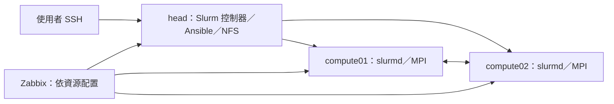

# 面試專案：可重建的迷你 HPC 叢集

狀態：已完成單節點 Slurm 工作與[Python 健檢工具](healthcheck/README.md)；
跨節點建置、MPI 工作及整合展示仍待後續模組交付。
依[能力路線](../curriculum/ROADMAP.md)逐步完成作品。

目標：在 GCP 私有網路內，以 Ansible 部署 Slurm 叢集，執行 C/MPI 工作，配合 Python 健檢、共享儲存與 Zabbix，展示部署、排程、觀測、除錯和復原能力。



圖為目標架構，尚非已部署狀態。head 共用多項角色是降低實驗成本的取捨；不具生產高可用性。三台 GCP VM 的實體主機配置不確定，效能报告只針對本次環境。

## 需求對照

| 職缺要求 | 作品證據 |
|---|---|
| HPC 軟硬體集群規劃 | 拓撲、資源估算、假設、限制與擴充設計 |
| 網路設定管理 | 位址與名稱表、連線規則、NFS、網路故障報告 |
| 叢集建置自動化 | inventory、roles、乾淨 VM 重建與第二次執行結果 |
| Linux 與程式能力 | Python 健檢工具及測試、C/MPI 程式與正確性驗證 |
| 開源維運經驗 | Slurm 操作與 Zabbix 告警、服務故障到工作恢復的紀錄 |

## 必做驗收

- [ ] 三台獨立 VM 的版本、資源、位址與角色有文件，敏感資訊不公開。
- [ ] 從符合文件前置條件的乾淨 VM，以 Ansible 重建；人工步驟與依賴如實列出。
- [ ] 第二次部署沒有未解釋的變更，失敗節點恢復後可重跑。
- [ ] 兩台 compute 都能接收 Slurm 工作；以輸出中的主機名證明執行位置。
- [ ] C/MPI 程式正確處理不可整除工作量，結果與序列版本一致。
- [ ] MPI 工作跨兩台 compute 執行，保存 rank／主機名與工作輸出。
- [ ] Python 工具有 help、結構化輸出、逾時及部分失敗處理，保留測試結果。
- [ ] 量測至少三次，保留原始 CSV、資源配置、版本與圖表生成方式；不要求一定加速。
- [ ] Zabbix 有持續更新的節點指標，至少一項故障可觸發且恢復告警。
- [ ] 至少三份故障紀錄：名稱解析、工作資料路徑／權限、slurmd 停止或節點不可用。
- [ ] README、部署手冊、操作／復原手冊與十分鐘展示完整，沒有將規劃寫成完成。

若資源只能做單節點，先交付縮小版並明確標記跨節點驗收未完成。K8s 完整叢集、OpenStack 部署、GPU、RDMA、Lustre、Slurm accounting 資料庫列為後續選修，不阻塞核心作品。

## 建議實作目錄

```text
project/
  README.md
  ansible/              # inventory 範例、playbooks、roles
  healthcheck/          # Python 原始碼、測試、使用說明
  workloads/            # C/MPI、編譯方法、sbatch 腳本
  monitoring/           # 模板與告警定義，排除憑證
  benchmarks/           # 原始 CSV、分析程式、圖表
  docs/                 # 架構、部署、操作手冊、版本紀錄
  incidents/            # 真實演練報告
  demo/                 # 展示腳本、截圖或影片索引
```

這些是預期交付位置，待實作才建立內容。不要在尚未測量前填入重建耗時、效能提升或恢復時間。

## 十分鐘展示順序

1. 0–2 分鐘：需求、架構、GCP VM 規模與限制。
2. 2–4 分鐘：Ansible 設定與真實重建證據；展示重跑結果。
3. 4–6 分鐘：提交 Slurm MPI 工作，核對節點分布與計算結果。
4. 6–8 分鐘：展示告警及可恢復故障，說明取證與復原；過長流程以真實錄影補充。
5. 8–10 分鐘：量測結論、設計取捨、擴大至實體叢集還需哪些驗證。

履歷完成後可依真實結果寫：「於 GCP 建置 1 控制＋2 運算節點教學叢集，以 Ansible 自動化部署 Slurm／NFS，執行 C/MPI 工作並透過 Python／Zabbix 驗證健康與故障復原。」未達成前不得直接當作已完成經歷。
