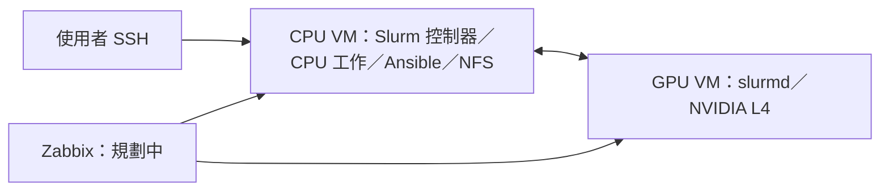

# 面試專案：可重建的迷你 HPC 叢集

狀態：CPU 控制／運算 VM 正在運行，原 L4 GPU VM 已停止並保留磁碟；
跨 VM MPI、共享資料與 Slurm GPU 工作已有先前的實際結果，
乾淨 GPU 節點首次部署及整合展示仍待交付。
依[能力路線](../curriculum/ROADMAP.md)逐步完成作品。

目標：在 GCP 私有網路內，以 Ansible 部署 Slurm 叢集，執行 C/MPI 工作，配合 Python 健檢、共享儲存與 Zabbix，展示部署、排程、觀測、除錯和復原能力。再用 K8s／GKE 執行適合容器的可核對工作，與 Slurm 比較工作及資源管理；對照 OpenStack 與目前 VM 供給流程。


```mermaid
flowchart LR
  U[使用者 SSH] --> C[CPU VM：Slurm 控制器／CPU 工作／Ansible／NFS]
  C <--> G[GPU VM：slurmd／NVIDIA L4]
  Z[Zabbix：規劃中] --> C
  Z --> G
```

圖中的 CPU VM 正在運行，原 GPU VM 目前已停止；Zabbix 仍是規劃中的監控元件。
最終規模維持[一台 CPU VM 加一台 GPU VM](docs/cluster-topology.md)；
GPU VM 將在乾淨節點驗證後替換，測試期間舊 VM 先停止保留。
運算節點所需的[Slurm 套件與原始碼](packages/slurm/README.md)已保存在專案中，
尚未於新 VM 安裝。
CPU VM 兼任多項角色是降低實驗成本的取捨，沒有生產高可用性。
兩台 GCP VM 的實體主機配置不確定，效能報告只針對本次環境。

## 需求對照

| 職缺要求 | 作品證據 |
|---|---|
| HPC 軟硬體集群規劃 | 拓撲、資源估算、假設、限制與擴充設計 |
| 網路設定管理 | 位址與名稱表、連線規則、NFS、網路故障報告 |
| 叢集建置自動化 | inventory、playbook、乾淨 GPU 節點加入既有控制節點的首次部署證據 |
| Linux 與程式能力 | Python 健檢工具及測試、C/MPI 程式與正確性驗證 |
| 開源維運經驗 | Slurm 操作與 Zabbix 告警、服務故障到工作恢復的紀錄 |
| K8s／GKE | 工作定義、實際執行結果、Pod 狀態與日誌、資源清除及 Slurm 對照 |
| OpenStack | VM、網路、映像與身分管理的供給流程對照；有可用平台時再加實際操作證據 |

## 必做驗收

- [ ] 兩台 VM 的版本、資源、位址與角色有文件，敏感資訊不公開。
- [ ] 從符合文件前置條件的乾淨 GPU VM，以 Ansible 加入既有控制節點；人工步驟與依賴如實列出。
- [ ] CPU VM 與 GPU VM 都能接收各自分區的 Slurm 工作；以輸出中的主機名證明執行位置。
- [ ] C/MPI 程式正確處理不可整除工作量，結果與序列版本一致。
- [ ] MPI 工作跨 CPU VM 與 GPU VM 執行，保存 rank／主機名與工作輸出。
- [ ] Python 工具有 help、結構化輸出、逾時及部分失敗處理，保留測試結果。
- [ ] 量測至少三次，保留原始 CSV、資源配置、版本與圖表生成方式；不要求一定加速。
- [ ] Zabbix 有持續更新的節點指標，至少一項故障可觸發且恢復告警。
- [ ] GKE 上的 K8s 工作有可核對結果、狀態、日誌與資源清除證據；事先確認預算。
- [ ] OpenStack 與現有 VM 供給流程有具體對照；實作範圍按是否取得平台如實標示。
- [ ] 至少三份故障紀錄：名稱解析、工作資料路徑／權限、slurmd 停止或節點不可用。
- [ ] README、部署手冊、操作／復原手冊與十分鐘展示完整，沒有將規劃寫成完成。

目前 GPU 配額僅允許一張卡；替換節點時先停止舊 GPU VM，並保留回復方式。
沒有 OpenStack 平台時不能宣稱實際操作經驗。RDMA、Lustre、Slurm accounting 資料庫需有需求與相應環境才展開；Zabbix 和 GKE 仍屬後續模組目標。

## 建議實作目錄

```text
project/
  README.md
  ansible/              # inventory 範例、playbooks、roles
  healthcheck/          # Python 原始碼、測試、使用說明
  workloads/            # C/MPI、編譯方法、sbatch 腳本
  monitoring/           # 模板與告警定義，排除憑證
  benchmarks/           # 原始 CSV、分析程式、圖表
  docs/                 # 架構、部署、操作手冊、版本紀錄
  incidents/            # 真實演練報告
  demo/                 # 展示腳本、截圖或影片索引
```

這些是預期交付位置，待實作才建立內容。不要在尚未測量前填入重建耗時、效能提升或恢復時間。

## 十分鐘展示順序

1. 0–2 分鐘：需求、架構、GCP VM 規模與限制。
2. 2–4 分鐘：Ansible 設定與乾淨 GPU 節點加入既有控制節點的真實證據。
3. 4–6 分鐘：提交 Slurm MPI 工作，核對節點分布與計算結果。
4. 6–8 分鐘：展示告警及可恢復故障，說明取證與復原；過長流程以真實錄影補充。
5. 8–10 分鐘：量測結論、設計取捨、擴大至實體叢集還需哪些驗證。

履歷完成後應依實際證據描述兩台 VM 的角色、工作與驗證範圍；
不能把控制 VM 兼任 CPU 運算節點說成另有獨立 CPU 運算 VM，
也不能把乾淨 GPU 節點驗證寫成整個叢集從零重建。
